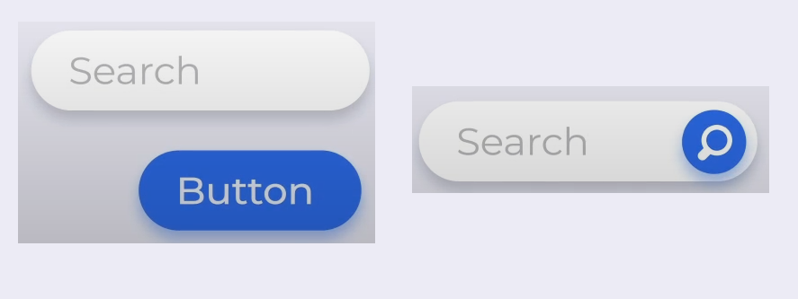
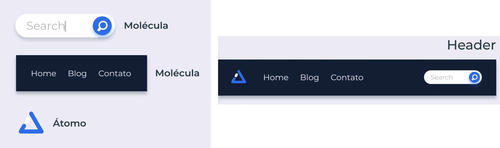
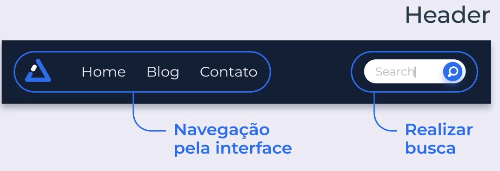
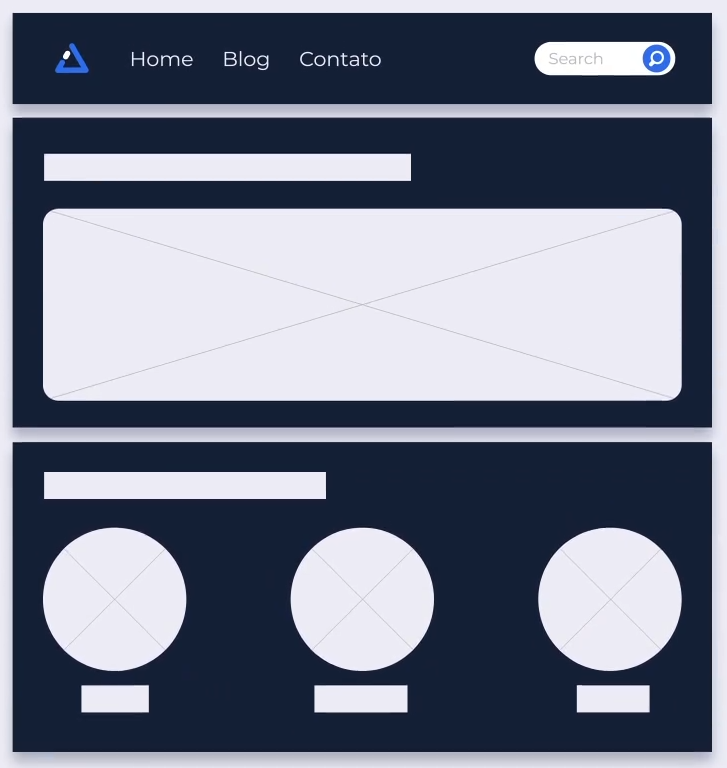
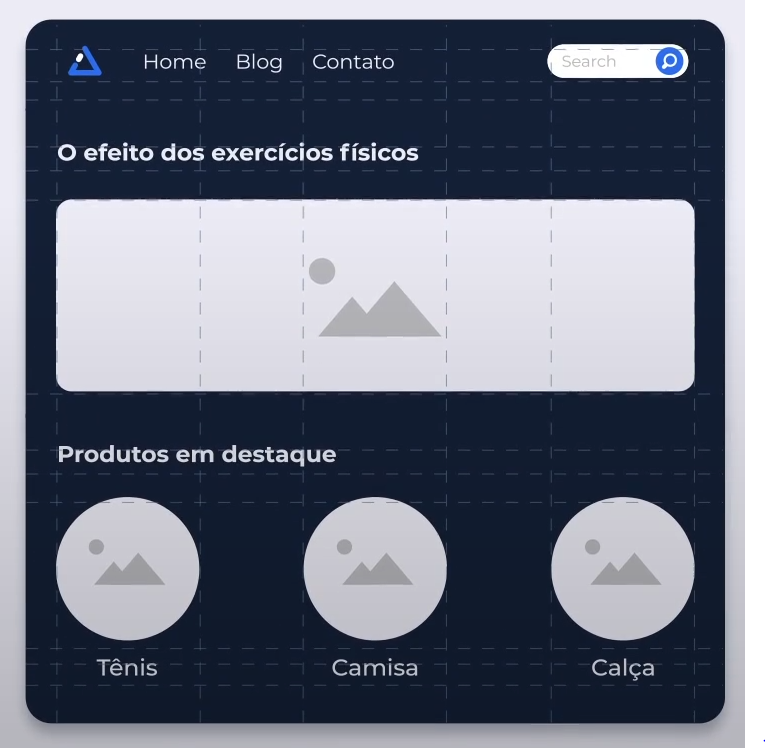
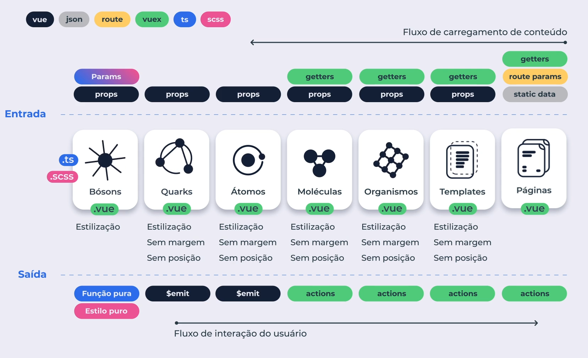

# Atomic Design

Criado por Brad Frost

É somente uma forma de organização de projetos, aplicadas ao:

1. Layout

2. Documentação

3. Forma de criação de testes

4. Separação de arquivos

5. Funcionalidades

6. Reutilização de código

**"Do princípio, as reações químicas são representadas por equações químicas, que frequentemente mostram como os elementos atômicos se combinam para formar moléculas"**

**Átomos** se combinam para formar **Moléculas**, se combinando para formar **Organismos** relativamente complexos.

O criador determinou 5 estágios de divisão:

1. Átomos

2. Moléculas

3. Organismos

4. Templates

5. Páginas

Também dando espaço para os Bósons e Quarks.

---

## Átomo

Ele é um elemento indivisível presente na interface gráfica, no mundo dos componentes eles são as <tags html>

Exemplo:

Botões, campos de formulário, títulos, parágrafos, links, imagens etc.

Isso é, as menores partes da interface gráfica.

## Moléculas

São 2 ou + átomos mantidos juntos para funcionar com um **único propósito**.

Exemplo:

Input + Botão = Molécula de busca



## Organismos

São 1 ou + moléculas juntas que começam a moldar a navegação e a leitura do conteúdo na interface. Ao contrário das moléculas, os organismos podem ter **vários propósitos** funcionando paralelamente.

Exemplo:

A molécula de busca + Molécula de Navegação + Átomo de Logotipo = Organismo Header



E o propósito paralelo seria



## Templates

Consistem em **grupos de organismos** e outros componentes combinados para **formar páginas**.



## Páginas

Páginas são **evoluções reais dos templates**, porém com conteúdo real ao invés de conteúdo subjacente, ou seja, as páginas são os componentes de níveis mais alto. O Layout final que será exibido para o usuário.

## Bósons

Os bósons fazem grande diferença no visual e legibilidade da interface, não sendo necessariamente visíveis, pois os bósons são elementos abstratos.

Exemplo:

Paleta de cores, fontes, animações e aspectos mais invisíveis de uma interface: grid layout.



## Quarks

Nunca encontrado sozinho, somente existindo quando existir um elemento completo.

Exemplo: 

Setas de um slider, itens que enviam feedback de validação de formulários, etc.

---

# VUE SCHEMA



---

### Básico instalação

```html
vue create atomic-design
```

Uso do 

Typescript/CSS Pre-processors/ Linter/ Formatter

SASS/SCSS (with node sass)

```
npm install normalize.css
```

importar normalize.css no main.ts

```
import 'normalize.css'
```

Configuração do .prettierrc

```
{
  "trailingComma": "none",
  "semi": false,
  "arrowParens": "always",
  "singleQuote": true
}
```

---

### BOAS PRÁTICAS VSCODE

#### Settings vscode

Podemos criar uma pasta de configuração do vscode para cada projeto, criando uma pasta **.vscode** com o arquivo **settings.json**.

Para esse projeto:

```json
{
  "vetur.experimental.templateInterpolationService": true
}
```

#### Criando uma estrutura .vue

Dentro da pasta **.vscode**, criamos a pasta **vetur** e dentro dele outra pasta **snippets**. Dentro da pasta **snippets** criamos o arquivo template com o nome qualquer com extensão **.vue**.

No arquivo template colocamos a nossa estrutura.

```javascript
<template>
  <div class="component"></div>
</template>

<script lang="ts">
import { defineComponent } from 'vue'

export default defineComponent({})
</script>

<style lang="scss" scoped>
.component {
}
</style>
```

Depois de reiniciado o vscode ou somente feito reload (crtl + p, depois > reload):

Já no componente que queremos criar, somente precisamos começar a digitar o nome do template e seja feliz. :D
